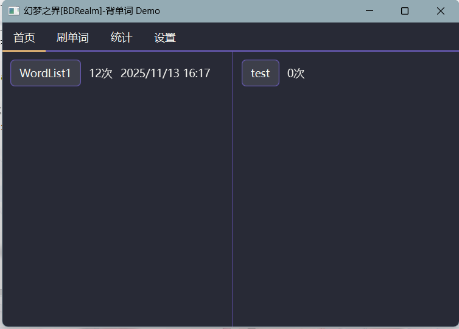
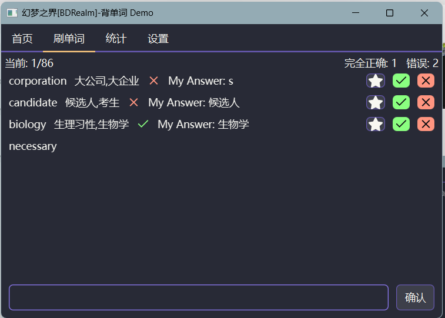
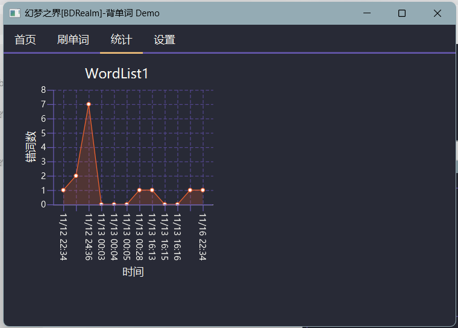

# MemorizeWords
基于JavaFX的刷单词软件

当前处在开发阶段，未发布构建版本，但可自行构建使用

## 环境
* Java21
* JavaFX(已打包放进资源文件夹，可直接解压使用)
* Ollama(可选,任意大模型url皆可)


## 构建
1. 下载项目，在终端中输入通过mvnw clean package构建即可
2. 启动Ollama
3. 在构建好的jar文件目录下，通过终端命令启动jar文件
```
java --module-path ".\javafx-sdk-21.0.6\lib" --add-modules javafx.controls,javafx.fxml -jar MemorizeWords-0.1.jar
```
注意需要将".\javafx-sdk-21.0.6\lib"替换为javafx的lib文件夹路径
<br>如果电脑没有安装JavaFx-sdk，可解压项目资源目录下的JavaFx包，使用绝对路径

Ps： 如果未使用Ollama，需要在自动生成的config.yml中修改url和使用的模型名称。<br>项目没有兼容apikey，可自行修改“MemoryPage.java”文件进行兼容。

## 效果图
### 首页

<br>可选择单词表，左侧为预设固定单词表，当前仅WordList1，可自行在WordList文件夹增添内容。
<br>按钮右侧会显示总共完成了多少次，最后一次完成的时间。
<br><s>右侧准备制作为自定义的错词集，未开始制作。</s>
### 刷单词

<br>第一遍为英译中，全部正确后开始第二遍中译英。通过大模型判断正误，本地gemma3:1b大模型正确率90%左右。
<br>已关闭大模型思考，本地延迟不超过0.2-0.3s。
<br>如果大模型判断错误，可通过右侧按钮强制修正。
<br><s>收藏按钮未开始制作。</s>
### 统计

<br>每次刷完一整个WordList，会记录时间和错词数，生成统计图。
<br>错的哪些词也记录了，但暂未利用，存储在Data文件夹中。